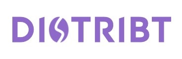
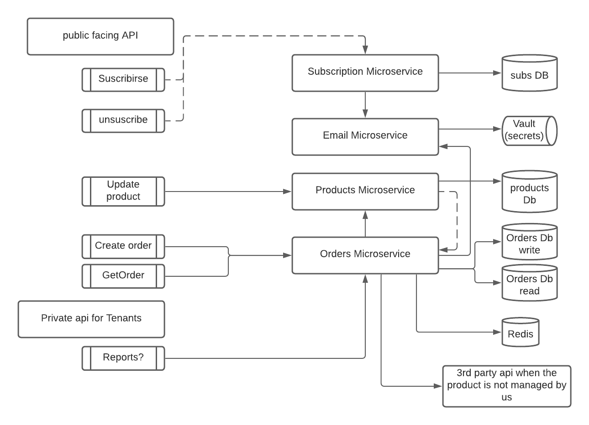

# Distribt

## ¿Qué es Distribt? 

Distrib es un proyecto Open Source creado para mostrar el funcionamiento y uso de los sistemas distribuidos con las implementaciones en .NET Core.

La aplicación va a ser "vendor free" lo que quiere decir que no va a estar enlazada directamente a ningún proveedor específico. Obviamente vamos a utilizar X o Y servicio (ya que no vamos a reinventar la rueda), pero lo haremos a través de abstracciones.  

Es importante saber estos conceptos ya que cada día las empresas están migrando sus aplicaciones monolíticas a microservicios o incluso serverless, y para poder aplicar un correcto funcionamiento, debemos aprender sobre sistemas distribuidos. 

## ¿Qué vamos a ver? 
Vamos a ver un sistema distribuido con múltiples características, como pueden ser patrón consumer/publiser, sagas, service discovery, Eventual consistency, etc.

La arquitectura que vamos a ver es la siguiente:

- Nota: las etiquetas amarillas representan el código ya implementado.

Puedes encontrar el proceso de creación del sistema en [mi curso de YouTube](https://www.youtube.com/playlist?list=PLesmOrW3mp4jpSbdFMtVWINJZ7OLdSASS).

Alternativamente, si lo prefieres, puedes seguir los post con el código detallado y los razonamientos sobre por qué se ha elegido cada tecnología en mi web [NetMentor - Cruso Distribt](https://www.netmentor.es/curso/sistemas-distribuidos)

Si estás siguiendo el curso vídeo a vídeo tienes diferentes branches en este repositorio con el código de cada vídeo (de forma incremental) aquí:  https://github.com/ElectNewt/Distribt/branches/all 

## Infraestructura
Hasta ahora hemos visto las siguientes funcionalidades:

* [API Rest](https://www.netmentor.es/entrada/api-rest-csharp) microservicios creados con .NET
* [Patrón API Gateway](https://www.netmentor.es/entrada/patron-api-gateway) con YARP.
* [Producers/Consumers](https://www.netmentor.es/entrada/patron-productor-consumidor) para la comunicación asíncrona [implementado con RabbitMQ](https://www.netmentor.es/entrada/rabbitmq-comunicacion-asincrona).
* [Acceso y almacenamiento seuguro](https://www.netmentor.es/entrada/gestion-credenciales-vault) de la informción secreta con Vault.
* [Registro de servicios](https://www.netmentor.es/entrada/service-registry-discovery-consul) con Consul (service discovery / Service registry).
* [Sistema de logs](https://www.netmentor.es/entrada/servicio-logs-graylog) con GrayLog y SeriLog.
* [CQRS](https://www.netmentor.es/entrada/patron-cqrs-explicado-10-minutos) para separar lecturas de escrituras.
* [Event Sourcing](https://www.netmentor.es/entrada/event-sourcing-explicado-facil) junto a MongoDb para almacenar los eventos.
* [Eventual Consistency](https://www.netmentor.es/entrada/consistencia-eventual-microservicios) usando comunicación asíncrona para sincronizar los diferentes microservicios.
* [Unificación de las API](https://www.netmentor.es/entrada/unificar-respuestas-api) para tener una respuesta consistente con [Rop](https://www.netmentor.es/entrada/railway-oriented-programming).
* [Patrón SAGA](https://www.netmentor.es/entrada/patron-saga) para las transacciones distribuidas.
* [Health checks](https://www.netmentor.es/entrada/health-checks-asp-net) Para la visibilidad de la salud de nuestros microservicios.
* [Observabilidad](https://www.netmentor.es/entrada/monitorizacion-sistemas-distribuidos) De nuestro sistema e infraestructura (metricas y traces) con OpenTelemetry, Prometheus, Grafana y Zipkin
* [API Key](https://www.netmentor.es/entrada/explicacion-api-key) Para las llamadas desde clientes.
* [Rate Limiting](https://www.netmentor.es/entrada/rate-limiting) Para limitar el uso de recursos.
* [Aspire](https://www.netmentor.es/entrada/introduccion-net-aspire) Para ejecución local de las applicaiones. nota, está solo en un [branch](https://github.com/ElectNewt/Distribt/tree/17-Aspire-version2023) ya que aspire sigue en preview.

## Documentación [En progreso]
Puedes encontrar documentación de cada projecto dentro de `Shared` en la carpeta `docs`.
* Shared.Communication - [Enlace](docs/communication/Readme.md)
* Shared.Discovery - [Enlace](docs/discovery/Readme.md)
* Shared.Secrets - [Enlace](docs/secrets/Readme.md)

## Descripción del repositorio

Todo el contenido se encuentra en este mismo repositorio esto es así para una mayor facilidad a la hora de ver cómo funcionan las diferentes herramientas.

Puedes encontrar el código dentro de la carpeta `src`. Donde encontrarás múltiples carpetas.

Nota: Técnicamente cada carpeta representa un dominio y puede ser su propio repositorio independiente, pero para una mayor facilidad del desarrollo y del seguimiento en los vídeos y posts está todo en un único repo.

* Api: capa de abstracción de una API Gateway.
* Services: Carpeta que contiene los microservicios del sistema.
* Shared: código común de las abstracciones.

## ¿Cómo ejecutar la aplicación? 

Para ejecutar la aplicación correctamente debes tener [Docker](https://www.netmentor.es/curso/docker) instalado en tu máquina y entender cómo funciona docker-compose.

He creado un fichero `docker-compose.yaml` que ya contiene toda la configuración necesaria para que una vez ejecutes la solución, esta funcione sin problemas.

Eventualmente lo veremos toda la configuración en kubernetes (con [project tye](https://github.com/dotnet/tye)).

Para poder ejecutar la aplicación correctamente en local, necestiaras ejecutar tanto el fichero `docker-compose` como la configuración para los diferentes servicios utilizados. 

Para ahorrar tiempo he creado un fichero `bash` que ejectua todo `./tools/local-development/up.sh`

Y luego simplemente ejecuta cada aplicacion de forma individual o en un compound para poder testearlas.

## Dale una estrella ⭐
Si te gusta el proyecto no dudes en darle una estrella, hacer un fork junto a una PR o incluso apoyar económicamente el proyecto [donando un café](https://www.buymeacoffee.com/netmentor).
